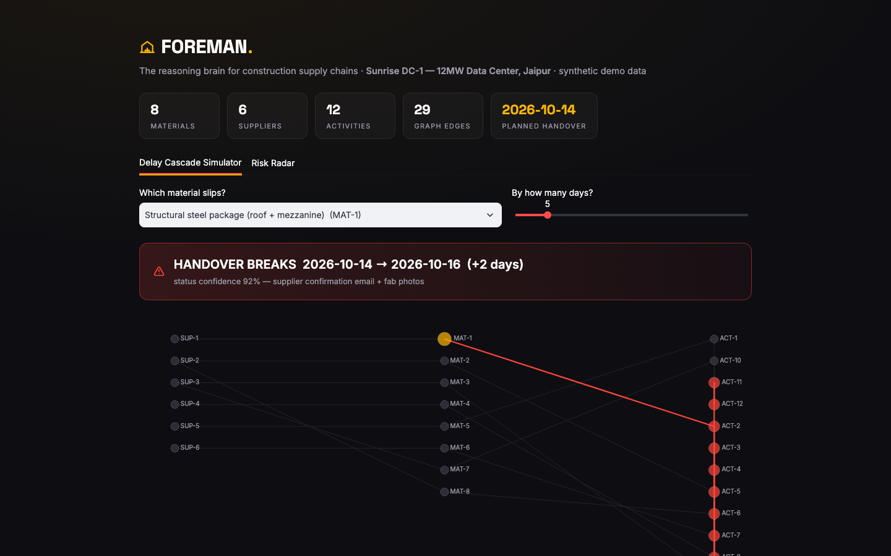
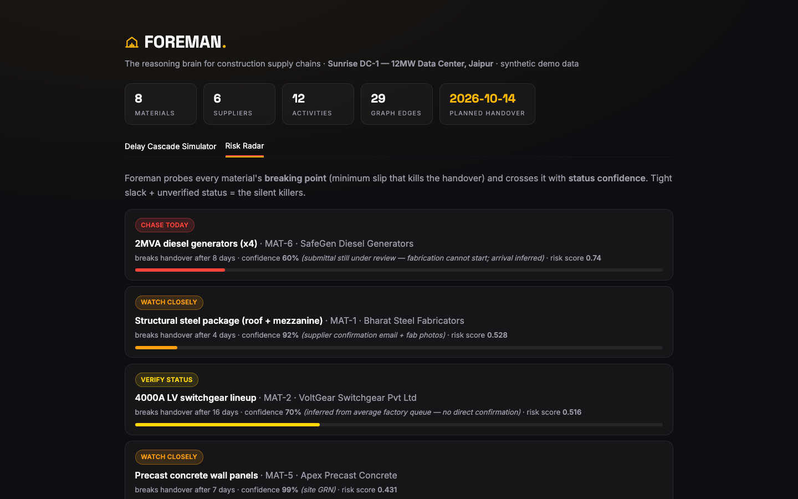

<p align="center">
  
</p>

<h1 align="center">Foreman</h1>

**The reasoning brain for construction supply chains.**

Everyone predicts *if* a material is late. Foreman predicts **what it breaks** — which downstream activities slip, whether the handover date survives, how confident it is, and what to do about it.

> Kaya AI IIT India Hackathon 2026 · **Team Gozers** (Aeshvarya Awasthi + Varunika Rai, IIT Jodhpur) · Track: **Supply Chain**
> *Stage 1 prototype slice. Full agentic system (LLM query agent, Neo4j, richer uncertainty modeling) lands in Stage 2.*

---

## The problem

On mission-critical builds like data centers, the moment materials are ordered, visibility collapses: What's approved? What's being fabricated? What's delayed? Will it arrive by its **ROJ (Required-On-Job) date**? Answers live in emails, calls and disconnected systems — so slippage is caught **too late**, and one late item cascades: late steel blocks concrete, which blocks MEP, which moves the handover. Megaprojects average **~79% cost overruns**, with material slippage a leading driver.

A delay-prediction dashboard is a warning light. It can't tell you *why*, *what else breaks*, or *how sure it is*. **Foreman is not a dashboard — it's a reasoning brain.**

## What this prototype does (all real, nothing mocked)

**1. Knowledge graph** (`src/graph.py`) — a typed directed graph of the post-order supply chain:

```
Supplier ─SUPPLIES→ Material ─FEEDS_ACTIVITY→ ScheduleActivity ─DEPENDS_ON→ … → HANDOVER
```

Every node/edge carries metadata and a **confidence score** (site GRN 99% > GPS feed 95% > supplier email 92% > verbal update 75% > inferred 60%).

**2. CPM cascade engine** (`src/cascade.py`) — the star. A real Critical-Path-Method forward pass honoring both the dependency network *and* material arrival constraints. Ask *"the 4000A switchgear slips 5 days — what breaks?"* and it computes the answer:

- which activities slip, and by exactly how many days
- which activities **absorb** the hit through schedule float
- whether the **handover milestone breaks**, and by how much
- a mitigation call ("expedite by N days to protect handover")

Verified behaviors on the demo project:
| Scenario | Foreman's verdict |
|---|---|
| Structural steel +5d (critical path) | 🔴 handover breaks +2d |
| Switchgear +15d | 🟢 float absorbs it — don't panic |
| Switchgear +20d | 🔴 handover breaks +5d |
| Generators +10d (60% confidence, submittal stuck) | 🔴 breaks +3d — *the silent killer* |

That contrast **is** the intelligence: a dumb tracker panics at every delay; Foreman knows which delays matter.

**3. Proactive risk radar** (`src/risk.py`) — doesn't wait for a delay to be reported. Binary-searches the cascade engine to find each material's **breaking point** (minimum slip that kills the handover), crosses it with status confidence, and ranks the silent killers. Demo output: the generators — 8 days of slack, 60% confidence, submittal still under review — rank #1: **chase that vendor today.**

**4. Demo UI** (`app.py`) — Streamlit, dark/amber. A cascade simulator with live graph viz + the risk radar.





## Run it

```bash
pip install -r requirements.txt
streamlit run app.py
```

## Demo data

`data/project.json` — **Sunrise DC-1**, a synthetic 12MW data-center build: 8 materials, 6 suppliers, 12 schedule activities ending at commissioning/handover. Synthetic, but modeled on real construction supply-chain structures (POs, submittals, fabrication states, ROJ dates, GRNs).

## Architecture & research grounding

The design follows recent work on KG+LLM operational reasoning (iterative sub-question decomposition over knowledge graphs lifted accuracy 41%→82% in analogous systems), uncertainty-guided multi-agent KG construction (Helicase), and probabilistic CPM schedule updating. Stage 2 adds the LLM query agent ("Will the CRAC units make ROJ?" in plain English), Neo4j persistence, and Monte-Carlo handover-risk distributions — an intelligence layer designed to sit **on top of** platforms like Kaya's Amber, not replace them.

*Kaya tells you where your material is. Foreman tells you what breaks if it's late — and how to save the date.*

---

**Team Gozers** — Aeshvarya Awasthi · Varunika Rai · IIT Jodhpur
