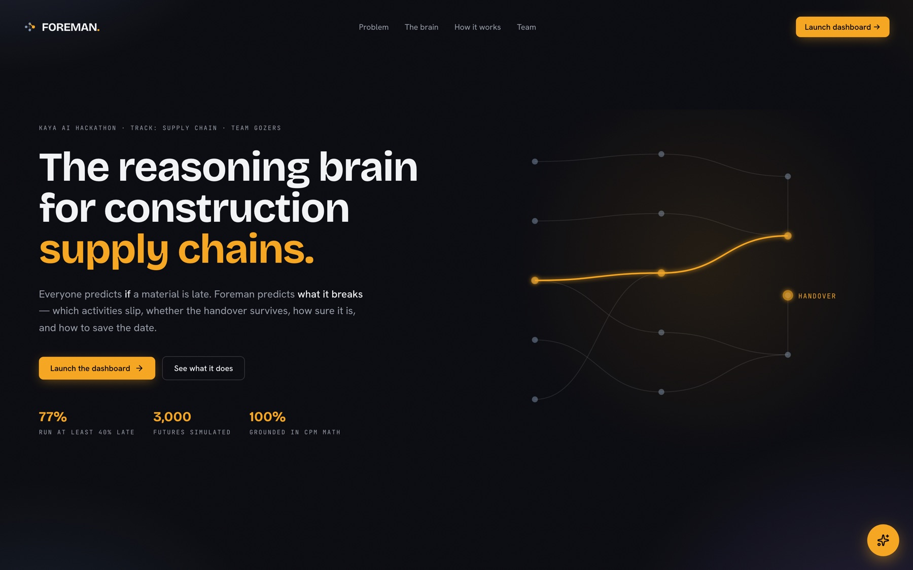
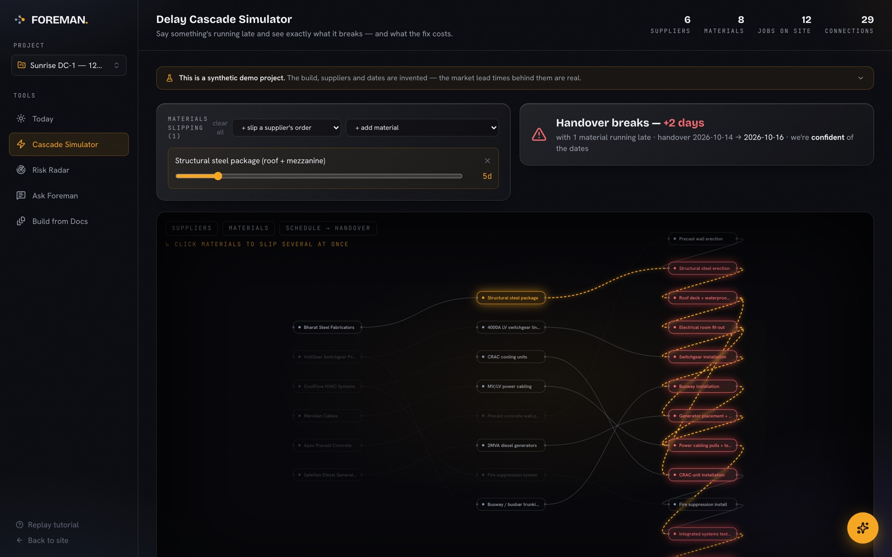
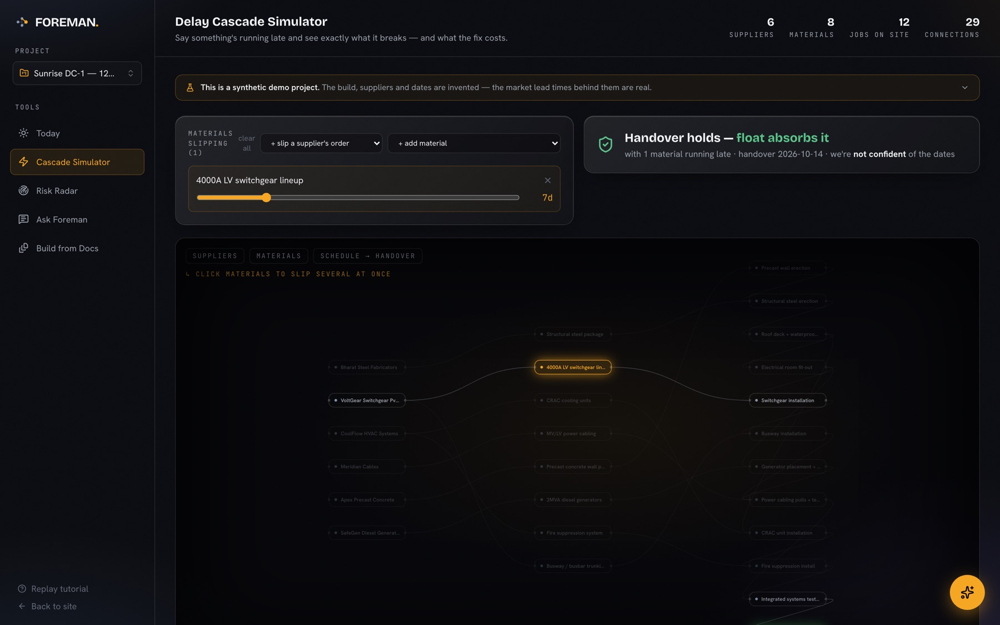
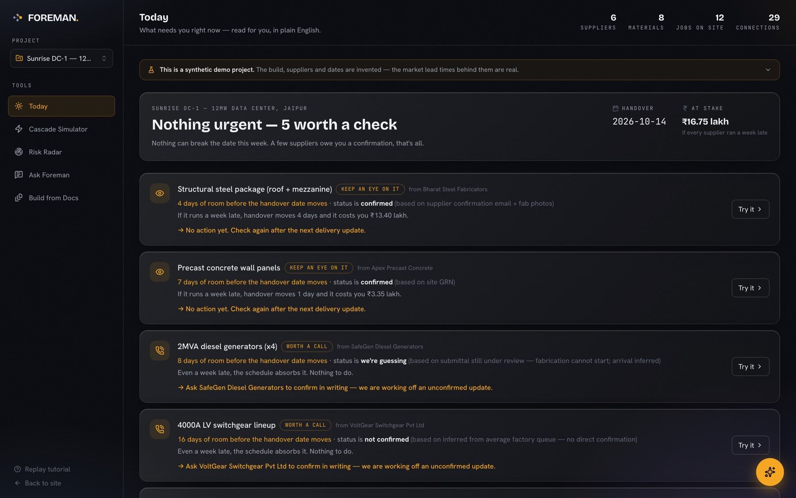
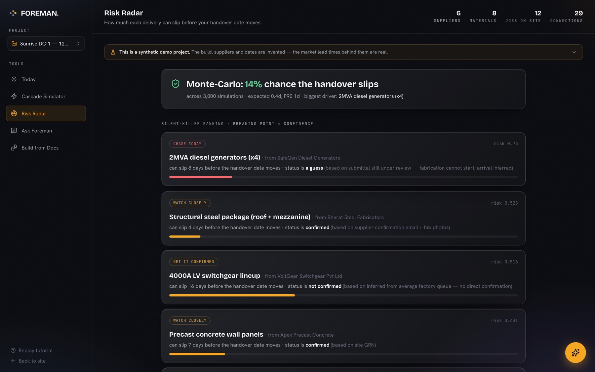
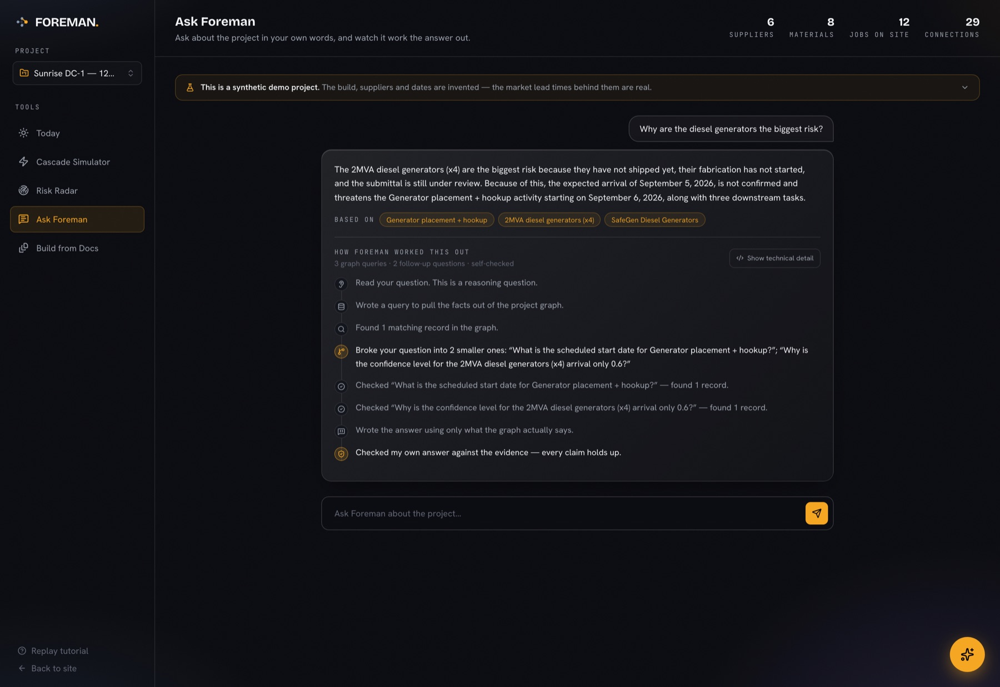
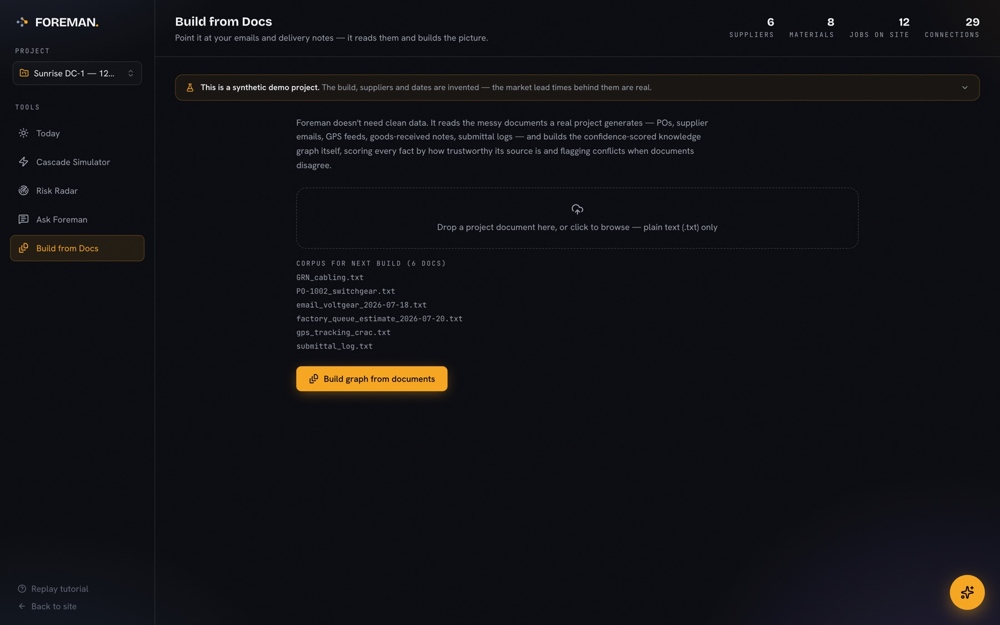
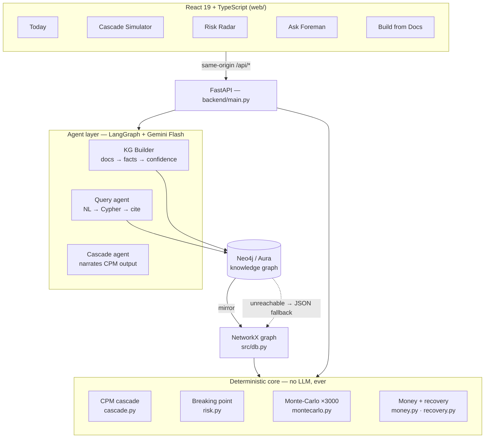

<p align="center">
  
</p>

<h1 align="center">Foreman</h1>

<p align="center"><strong>The reasoning brain for construction supply chains.</strong></p>

<p align="center">
  Everyone predicts <em>if</em> a material is late.<br>
  Foreman predicts <strong>what it breaks</strong> — which jobs slip, whether the handover date survives,<br>
  how sure it is, and what the cheapest fix costs.
</p>

<p align="center">
  <a href="https://foreman-yi3t.onrender.com"></a>
</p>

<p align="center">
  
  
  
  
  
  
  
</p>

<p align="center">
  <sub>Kaya AI IIT India Hackathon 2026 · <strong>Team Gozers</strong> · Track: <strong>Supply Chain</strong> · Round 2</sub>
</p>

<p align="center">
  <a href="https://foreman-yi3t.onrender.com">
    
  </a>
</p>

---

## The 15 seconds that explain the whole project

Same engine. Same project. Same question — *"this is running late, what happens?"*
**Opposite answers.**

| Structural steel slips 5 days | Switchgear slips 7 days |
|---|---|
|  |  |
| 🔴 **Handover breaks — +2 days.** Steel is on the critical path, so the slip travels all the way to the handover date. | 🟢 **Handover holds — float absorbs it.** The switchgear has slack. Nothing downstream moves. |

A tracker panics at both. **Foreman knows which one matters** — because it runs real Critical-Path-Method math, not a heuristic. That second screenshot is the important one: anyone can build something that shouts. Staying quiet when the schedule genuinely absorbs a hit is what proves the engine is real.

---

## The problem

**77% of megaprojects run at least 40% late.** On mission-critical builds like data centers, the moment materials are ordered, visibility collapses: What's approved? What's being fabricated? Where is it? Will it arrive by its **ROJ (Required-On-Job)** date?

Those answers live in inboxes, phone calls, and disconnected systems — so slippage gets caught too late. And delays don't stay put: late steel blocks concrete, which blocks MEP, which moves the handover, which triggers liquidated damages.

This is worse in 2026 than it has ever been. Real market lead times right now:

| Item | 2026 lead time | Context |
|---|---|---|
| MV switchgear (15kV) | **52–80 weeks** | Effectively sold out through 2028 in many channels |
| Generators | **20 → 60 weeks** | Cummins sold out of high-HP gensets through 2028 |
| Substation transformers | **140 → 160+ weeks** | Largest HV units approaching 4 years |

A delay-prediction dashboard is a warning light. It cannot tell you *why*, *what else breaks*, or *how sure it is*.

> **Foreman is not a dashboard. It's a reasoning brain.**

---

## What it actually does

### 🌅 Opens on what needs you — not on an empty simulator



Most tools hand you a blank canvas and expect you to know what to ask. Foreman opens already knowing: it reads the whole graph, ranks what's worth your attention, prices what's at risk, and says it in the language a site manager actually uses — *"8 days of room before the handover date moves"*, not *"float = 8"*.

Note the headline: **"Nothing urgent — 5 worth a check."** It is willing to tell you there's no fire.

### ⚡ The cascade engine — the star

A true CPM forward pass honoring both the dependency network **and** material arrival constraints. Say something slips and it computes which activities move, which absorb it through float, whether the handover breaks, and by how much.

**The LLM never touches the number path.** It narrates what the CPM engine computed; it cannot invent a date. That is a deliberate design decision, and it's what makes the math auditable.

### 🎯 Risk radar — the silent killers



For every material, Foreman binary-searches the cascade engine for its **breaking point** — the exact number of days it can slip before the handover moves — then crosses that with how much we actually trust the data.

That ranking is the insight. The switchgear can slip **16 days**; the generators only **8** — and the generators' status is *"a guess"* (submittal still under review, so fabrication can't start and the arrival is inferred). The quiet, unconfirmed item outranks the loud one. A Monte-Carlo over 3,000 futures agrees: **14% chance the handover slips**, driven almost entirely by those generators.

### 💬 Ask it in English — and watch it reason



A LangGraph agent classifies the question, writes read-only **Cypher** against Neo4j, self-corrects on failure, and answers with citations back to real graph nodes.

When a question is too big to answer in one hop, it **breaks it into sub-questions**, gathers evidence for each, drafts an answer, then **checks its own answer against the evidence** and fetches whatever is missing before answering again (bounded at 3+1 rounds). The screenshot above shows exactly that: *3 graph queries · 2 follow-up questions · self-checked*.

**The critical constraint: reflection can only ever ADD graph evidence. It can never invent.** Every step is shown in plain English, with a toggle for the raw Cypher — so a site manager reads sentences and an engineer inspects the query.

### 📄 It builds its own brain from raw documents



Feed it the mess a real project generates — POs, supplier emails, GPS pings, goods-received notes, submittal logs. It extracts source-tagged facts and scores each by how much that *kind* of source deserves to be trusted:

```
site GRN 99%  >  GPS ping 95%  >  supplier email 90%  >  verbal 75%  >  inferred queue 60%
```

When sources disagree it **resolves by source weight and lowers confidence**. On the demo corpus it catches that the switchgear supplier's email ("arrives Aug 20") conflicts with the factory-queue model ("Aug 24"), keeps the stronger source, drops confidence to **72%**, and flags it for a human. Auditable intelligence, not a black box.

### 💰 Every delay priced, every fix ranked in rupees

This is the layer no comparable project has at all. Foreman doesn't stop at *"the handover breaks"* — it tells you what that costs and what to do:

**Generators 14 days late → 7-day handover slip → ₹23.45 lakh exposed** (₹3.35 lakh/day)

| Fix | Buys | Costs | Keeps |
|---|---|---|---|
| Rent from PowerHire instead | **7 days** | ₹4 lakh | **₹19.45 lakh** |
| Pay to expedite fabrication | 7 days | ₹4.80 lakh | ₹18.65 lakh |
| Extra shifts on generator hookup | 2 days | ₹2.40 lakh | ₹4.30 lakh |

The **"buys N days"** figure is not asserted — it is **measured by re-running the cascade** with that fix applied and diffing the handover date. And the cost-of-waiting engine shows the same fix getting more expensive every week you don't act, until the cheap option physically disappears.

---

## Architecture


```mermaid
flowchart TB
    subgraph UI["React 19 + TypeScript (web/)"]
        T[Today] ~~~ C[Cascade Simulator] ~~~ R[Risk Radar] ~~~ A[Ask Foreman] ~~~ B[Build from Docs]
    end

    UI -->|"same-origin /api/*"| API["FastAPI — backend/main.py"]

    subgraph AG["Agent layer — LangGraph + Gemini Flash"]
        KG["KG Builder<br/>docs → facts → confidence"] ~~~ QA["Query agent<br/>NL → Cypher → cite"] ~~~ CA["Cascade agent<br/>narrates CPM output"]
    end

    subgraph DET["Deterministic core — no LLM, ever"]
        CPM["CPM cascade<br/>cascade.py"] ~~~ RISK["Breaking point<br/>risk.py"] ~~~ MC["Monte-Carlo ×3000<br/>montecarlo.py"] ~~~ MONEY["Money + recovery<br/>money.py · recovery.py"]
    end

    API --> AG
    API --> DET
    KG --> NEO[("Neo4j / Aura<br/>knowledge graph")]
    QA --> NEO
    NEO -->|"mirror"| NX["NetworkX graph<br/>src/db.py"]
    NX --> DET
    NEO -.->|"unreachable → JSON fallback"| NX
```

Two things worth calling out:

**1. The number path has no LLM in it.** Cascade, risk, Monte-Carlo, money and recovery are pure Python over a NetworkX graph. The LLM writes Cypher and explains results. It never produces a date or a rupee figure. Ask *"isn't this just a wrapper around an LLM?"* and the answer is in the call graph.

**2. Neo4j is a mirror, not a single point of failure.** The graph is rebuilt into NetworkX for the CPM engine, and `tests/test_mirror.py` asserts both produce **identical** cascade and risk output. If the graph database is unreachable, the app keeps answering from the mirror — only Ask Foreman degrades.

---

## Verified numbers

Everything below is reproducible against the live deployment, not screenshots of a mock.

| Check | Result |
|---|---|
| Structural steel +5d | Handover breaks **+2 days**, confidence 0.92 |
| Switchgear +15d | **Absorbed** — 0 days, confidence 0.70 |
| Generators +14d | 7-day slip, **₹23.45 lakh** exposure |
| Monte-Carlo (3,000 runs) | **14%** chance of handover slip |
| Graph | 6 suppliers · 8 materials · 12 activities · 29 relationships |
| Neo4j ↔ JSON parity | Identical across 8 materials × 3 delays |

```bash
curl -s https://foreman-yi3t.onrender.com/api/health
# {"ok":true,"graph":"neo4j","graph_detail":"26 nodes","llm":true}

curl -s -X POST https://foreman-yi3t.onrender.com/api/cascade \
  -H 'Content-Type: application/json' -d '{"material_id":"MAT-1","delay_days":5}'
```

---

## Run it locally

```bash
# 1. Python env + a free Gemini key — https://aistudio.google.com/apikey
python3 -m venv .venv && ./.venv/bin/pip install -r requirements.txt
cp .env.example .env          # paste your key into GEMINI_API_KEY

# 2. Frontend deps
cd web && npm install && cd ..

# 3. Neo4j (Docker) + API :8000 + web :5173
./dev.sh
```

Open **http://localhost:5173**.

## Deploy it

In production Foreman is **one service**: FastAPI serves the built React app from the same origin. No CORS, no API base URL to configure, one container, one URL.

```bash
docker build -t foreman .
docker run -p 8000:8000 -e GEMINI_API_KEY=... foreman
```

On Render, `render.yaml` deploys this as-is — set `GEMINI_API_KEY` in the dashboard.

### Environment variables

| Variable | Required | Effect if unset |
|---|---|---|
| `GEMINI_API_KEY` | for Ask only | Ask returns a clear 503; **everything else still works** |
| `NEO4J_URI` | no | Runs on the JSON mirror instead of Neo4j |
| `NEO4J_USER` / `NEO4J_USERNAME` | no | Defaults to `neo4j` |
| `NEO4J_PASSWORD` | no | — |
| `NEO4J_DATABASE` | no | Server default database |
| `ALLOWED_ORIGINS` | no | Local Vite dev origins (unused when same-origin) |
| `PORT` | no | `8000` |

> **Connecting Neo4j Aura:** Aura names **both the user and the database after the instance id**, not `neo4j` — connecting with the documented defaults fails with `Unauthorized`, then `DatabaseNotFound`. Foreman reads `NEO4J_USER` *or* `NEO4J_USERNAME` and an optional `NEO4J_DATABASE`, so the credentials file Aura gives you can be pasted in unchanged.

### Degrading gracefully

`/api/health` reports what the instance is actually running on, because a degraded deployment looks identical from outside — the pages render, the answers are just worse:

```json
{"ok": true, "graph": "neo4j", "graph_detail": "26 nodes", "llm": true}
```

## Tests

```bash
./.venv/bin/python tests/test_mirror.py   # Neo4j ↔ NetworkX parity (needs Neo4j up)
./.venv/bin/python tests/test_money.py    # money + recovery invariants
```

`test_mirror.py` is the one that matters: it proves swapping NetworkX for Neo4j changed nothing the CPM engine can see. `test_money.py` asserts recovery options never claim days they cannot deliver.

## Repo map

```
backend/main.py       FastAPI — 26 endpoints + static SPA serving
src/
  cascade.py          CPM forward pass — the core engine
  risk.py             breaking-point binary search
  montecarlo.py       3,000-future simulation
  money.py            exposure, penalties, commercials
  recovery.py         ranked fixes, "buys N days" by re-simulation
  timemachine.py      cost of waiting, week by week
  today.py            the morning brief
  db.py               Neo4j store + NetworkX mirror + JSON fallback
  graph.py            graph construction, node/edge kinds
  projects.py         multi-project storage, auto-seeding
  alt_supplier.py     alternate-supplier ranking
  comms.py            drafted supplier/client messages
  agents/
    kg_builder.py     documents → facts → confidence → conflict resolution
    query_agent.py    NL → Cypher → self-correction → citations
    brain.py          sub-questions + self-reflection loop
    cascade_agent.py  narrates CPM output in plain English
    project_builder.py  a sentence or a spreadsheet → a project
    llm.py            Gemini wrapper, caching, key handling
web/src/              React 19 dashboard, React Flow graph, Framer Motion
data/project.json     Sunrise DC-1 — synthetic 12MW data center
docs/ARCHITECTURE.md  deeper engineering write-up
docs/JUDGE-QA.md      the hard questions, answered honestly
```

## Honest limitations

Written by us, not extracted under questioning:

- **The project is synthetic.** Sunrise DC-1 is invented and labelled as such *inside the app*, on every screen. The **market lead times behind it are real 2026 figures**. We asked Kaya for a live data feed on 24 July; access wasn't granted before the deadline.
- **Confidence scores are calibrated by source type, not learned.** A GRN outranks a verbal update because that ordering is defensible, not because a model fit it to outcome data. With real project history this becomes a learning problem.
- **The alternate-supplier ranking is a capability-vector heuristic**, not the trained GNN the research line points toward.
- **Aura Free auto-pauses after 3 days idle**, and the free Render instance sleeps after 15 minutes. Cold start is ~30s. If the graph database is asleep, the app falls back to the JSON mirror and only Ask degrades.

## Research grounding

| Component | Line of work |
|---|---|
| Uncertainty-aware agentic KG construction | Helicase-style extraction (arXiv 2605.26835) |
| Iterative KG + LLM reasoning | Sub-question decomposition (arXiv 2507.17273) |
| Bayesian–Monte-Carlo schedule updating | arXiv 2605.17608 |
| Supply-network link prediction | Kosasih & Brintrup |

## How it extends Kaya

Kaya's **Amber** unifies submittal → delivery into a project graph: it manages procurement, tracks equipment, coordinates deliveries. That is the **doing**.

Foreman is the reasoning layer on top — the **knowing**. It answers the question a project director actually asks:

> *If this slips, what breaks, how sure are we, and what's the cheapest fix?*

**Amber does the doing. Foreman does the knowing.**

---

<p align="center">
  <strong>Team Gozers</strong> — Aeshvarya Awasthi · Varunika Rai · IIT Jodhpur<br>
  <sub><a href="https://foreman-yi3t.onrender.com">Live demo</a> · <a href="docs/ARCHITECTURE.md">Architecture</a> · <a href="docs/JUDGE-QA.md">Judge Q&A</a></sub>
</p>
